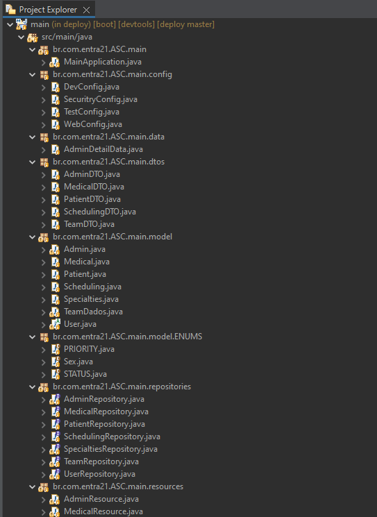

# 👩🏻‍⚕️ Aesculapius Scheduling Center 👨🏻‍⚕️

The initiative is to facilitate the scheduling of medical appointments with professionals from different areas of health. There are initially three profiles, the Patient, the Doctor - which can be any healthcare professional - and the Admin. To use the program, simply register, informing common data such as name, CPF (for the health professional, the CRM, CRE, CRO or CRP number for example), address for example. Patients will be able to search for which doctor will be available at the time they need it, they will be able to see their own appointments, change their dates and times, change professionals or even cancel an appointment. The doctor, on the other hand, will be able to share available times and days for patient care, view their appointments for the day and cancel a pre-booked appointment.

<br>
<p align=center>

<p>
<br>
<br>

## 1st step : Prototyping 👨🏻‍🎨
### Technologies : &nbsp;

One of the most important parts of developing, its prototype the system, because it makes the process of structuring the application a lot easier when comes about designing the screens. Thinking about it, Orange Team took some hours and a lot of imagination to desing the system layout. We used Figma for this. Here is the preview :

<br>

<br>
<br>
<br>


## 2nd step: Define the project management 🤖
### Technologies : &nbsp;

Another important point about development, it's to define the software to manage all the tasks on the backlog. For this, we used Trello.

<br>

<br>
<br>
<br>


## 3rd step : Project Versioning 🧩
### Technologies : &nbsp; &nbsp;

To manage the project versioning, we created an organization at Git. We organized the repositories between front-end and back-end.

<br>

<br>
<br>
<br>


## 4th step : Front end 🎨

### Technologies :  &nbsp; &nbsp; &nbsp; &nbsp; &nbsp; &nbsp; &nbsp; &nbsp;


Basing our concepts on the best practices of the front end developing, we are using Angular, a typescript framework, developed by Google. Angular is a framework based on the component concept. Each part of the code can be a component, with their own logic and peculiarities. We organized the components based on the user access. We have the components to the patient, the professional and the admin.
Each one has their own services and models, that comunicate with the back end , sending  the requests.

<br>
<p align=center>

<p>

<br>
<details>
<summary> 🙋🏻‍♀️ Patient profile 🙋🏻‍♂️ </summary>
The patient can login using email and password. The main page shows some professionals and specialties. It also contains a floating action button to add new appointments.

<br>

<br>
</details>

<br>
<details>
<summary> 👩🏻‍⚕️ Professional profile 👨🏻‍⚕️ </summary>
The professional can login using crm and password. The professionals main page, shows the appointments by day, week or even month. Professional can edit personal information and shift information.
<br>

<br>
</details>

<br>
<details>
<summary> 👩🏻‍🏫 Admin profile 👩🏻‍🏫 </summary>
The Admin can login with username and password, the main page shows some dashboards with system data, admin can also manipulate professionals and admins.
<br>

<br>
</details>

</details>


<br>

## 5th step : Back end 📊
### Technologies :  &nbsp;  &nbsp; &nbsp; &nbsp; &nbsp; &nbsp; &nbsp;  &nbsp;

To develop the back-end, we used Spring Boot (a Java framework) and Apache Maven to compile the application.

<br>
<p align=center>

<p>
<br>


The packages were structured following the MVC (Model, View and Controller) Standard. We created and deployed a REST (REpresentational State Transfer) API using SpringBoot and MySQL, applying JPA (Java Persistence API) and Hibernate (an object/relational mapping tool for Java environments).

We applied data validation and exception handling and properly use the HTTP protocol. 
Our client application represents our front end, that is directly connected with the back end, which recieves request from the front in the REST controller layer ( the resource layer). 

The REST layer -  where we implemented our business logic - and the service layer,  has the power to access the data layer and the repositories. The services and repositories are the ones that communicate with the application's domain classe. In the classes, we are using the DTO (Data Transfer Object) Standard. 
<br>
<br>
<br>


## Project installation requirements

## **Angular**
 >  GitHub must be installed, otherwise you can't clone the repository. You can download [here.](https://git-scm.com/downloads)

 <br>

1. Copy the project to your machine with the following command:

     `git clone https://github.com/Scheduling-Center-Aesculapius/main_Project`
2. Import the project into your IDE (we recommend VSCode).

3. Node must be installed.
        - If you don't have node installed, download it  [here](https://nodejs.org/en/).
4.  Angular CLI must be installed.
        - If the Angular CLI is not installed, run the following command in your terminal:
    
    `npm install -g @angular/cli@latest`
    
    - The project need some dependencies to work properly. To install the dependencies used in the project, with the project's  page open in the terminal, run:
    
    `npm install`
    
    - After these steps, you need to run `ng serve` . It will generate a link to be open in the browser with the application.
    
<br>

## **Spring**

1. To run the project properly, some development tools must be installed. Java JDK, Spring tools Suite and Maven must be installed and the environment variable defined.
2. To install Java JDK
    - Download JDK [here](https://www.oracle.com/java/technologies/downloads/#jdk19-windows)
    - Install the JDK exe File
    - Check the Directory ``C:\Program Files\Java\jdk-xxx`` if exists folder jdk;
3. To install Maven (it will compile the application)
    - Download Maven [here](https://maven.apache.org/download.cgi) ;
    - Unzip file; 
    - Create a folder named maven in ``C:\`` ; 
    - Press the Windows key on the keyboard and type: "edit system variables". Click on the option that appears.
    - In the "Environment Variables" screen that will open, click the "New" button just below the part of the screen that says "environment Variables".
    - In the variable name and value fields, fill in: ``MAVEN_HOME`` and ``C:\maven\bin``, respectively. Press "Confirm" button.
    - Check if it worked by opening a new prompt and typing ``mvn -version``. If it worked, an error will appears.
4. To install Spring Tools Suite
    - Download Spring Tools Suite [here](https://spring.io/tools)
    - Double click on the downloaded file to unzip.
    - Wait for unpacking.
    - A folder called ``sts-x.xx.x.RELEASE`` will be created in the unzip location.
    - Move the folder to a location of your choice.
    -Select the ``SpringToolSuite4`` application from inside the folder and create a shortcut on the desktop for easy access.
5. Make a project copy to your machine:

     `git clone https://github.com/Scheduling-Center-Aesculapius/deploy`
6. Import the project into your Spring Tools Suite.
    - File -> Import -> Maven -> Existing Maven Projects -> Next -> Browse -> Select Downloaded Project -> Finish
7. A change to the application.properties file is required.
    - It is necessary to define your bank address, username and password.
    - The file will look like this:
    ```` 
    spring.datasource.url=jdbc:mysql://localhost:3306/main
    spring.datasource.username=root
    spring.datasource.password=root
    ````

## **MySql**
>  To run the project, a database called `main` should be created. Spring is responsible for creating the tables.

1.  To create the database, open MySql Workbench. If you don't have it, install [here.](https://dev.mysql.com/downloads/workbench/)
2.  To create a schema, find a button with the database icon.
3.  Enter the bank name in the ``main``` case. Pay attention to the spelling, otherwise, Spring won't recognize the new schema.
4.  Finally click apply.

<br>

## **Testing the requests**
> Postman was the software we choose to test the application requests. It can be accessed on the browser or be downloaded [here.](https://www.postman.com/downloads/).

We created colletions to test the application requests. You can download the requests from [here](https://github.com/Scheduling-Center-Aesculapius/main_Project/tree/main/postman_requests)if you want.


## 🧡 Orange Team 🧡

<br>
<table align="center">
  <tr>
     <td align="center"> <!-- Ariana -->
      <a href="https://github.com/ariana-ssilva">
        
      </a>
      <br />
      <a href="https://github.com/ariana-ssilva">Ariana Silva</a>
    </td>                <!-- Ariana -->
    <td align="center">  <!-- Filipe -->
      <a href="https://github.com/Lipe-Albuquerque">
        
      </a>
      <br />
      <a href="https://github.com/Lipe-Albuquerque">Filipe Albuquerque</a>
    </td>                 <!-- Filipe -->
    <td align="center">   <!-- Thiago -->
      <a href="https://github.com/wzthiago">
        
      <br />
      <a href="https://github.com/wzthiago">Thiago de Souza</a>
    </td>                 <!-- Thiago -->
   </tr>
 </table>


<table align="center">
  <tr>
  <h1 align="center"> Our special thanks to our instructor in this journey
    <td align="center">   <!-- Thiago -->
      <a href="https://github.com/oliota">
        
      <br />
      <a href="https://github.com/oliota">Rubem Oliota</a>
    </td>                 <!-- Thiago -->
   </tr>
 </table>
 <br>
 <br>


 ## *Video*

 You can see the video we made to present the project [here](https://www.youtube.com/watch?v=9jdANsL3rLE)


<br>
<p align=center>

<p>
<br>